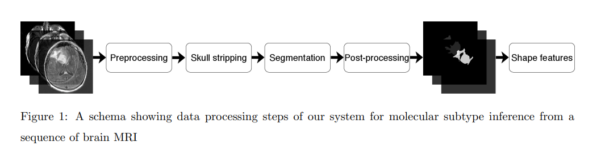
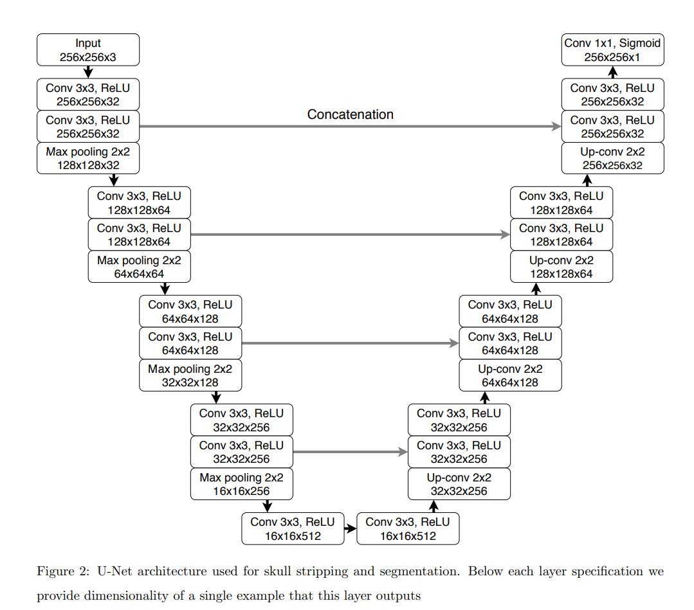

# brain-mri-segmentation

### Overview
- Goal is to identify a link between lower-grade glioma shape features and distinct genomic subtypes
- Apply deep learning to segment the MRI, extracting three features which quantify 2D and 3D characteristics
- Analyse the relationship between the imaging features and genomic subtype (IDH mutation, 1p/19q co-deletion, DNA methylation, gene expression, DNA copy number, and microRNA expression) 
- Lower grade gliomas (LGG) are a group of WHO grade II and III brain tumors, infiltrative and tend to recur and evolve to a higher-grade lesion. Patients with tumors from different molecular groups substantially differ in terms of typical course of the disease and overall survival
- Studies have shown an association of tumor shape features extracted from MRI with its genomic subtypes, manual segmentation of MRI is time consuming, and results can vary depending from annotator to annotator

### Molecular classifications of LGG

1. Molecular subtype based on IDH mutation and 1p/19q co-deletion
2. RNASeq clusters
3. DNA methylation clusters
4. DNA copy number clusters
5. microRNA expression clusters
6. Cluster of clusters

### Shape features of segmented tumors

1. Angular Standard Deviation (ASD)
    - The average of the radial distance standard deviations from the centroid of the mass across ten equiangular bins in one slice.
    - Measure of variation in the tumor margin, and non-circularity of the tumor
2. Bounding ellipsoid volume ratio (BEVR)
    - The ratio between the volume of segmented FLAIR abnormality and its minimum bounding ellipsoid. 
    - Essentially how regular the shape of the tumor is 
3. Margin fluctuation (MF)
      - Standard deviation in the difference between values before and after smoothing of distance from tumor centroid to the boundary. Radial distances are normalised to remove the impact of tumor size on its value 
      - Quantifies the amount of high frequency changes (i.e. smoothness) of the tumor boundary

### What is MRI?

- Magnetic resonance imaging (MRI) is a medical imaging technique used in radiology to form pictures of the anatomy and the physiological processes of the body
- MRI scanners use strong magnetic fields, magnetic field gradients and radio waves to generate images of the organs in the body.
- Does not involve ionising radiation
- Protons create a signal that is processed to form an image of the body in terms of the density of protons in a specific region. 
- The signal from a proton is different depending on its environment
  
## Methods
### Automatic segmentation

  
1. Preprocessing
    - Image size varied significantly
    - So images scaled into common frame of reference
    - Skull Stripping - deep learning algorithm 
    - Normalise intensities of tissues between cases - histogram
    - Z-score normalisation of entire data set
2. Segmentation
     - Fully convolutional neural network with the U-net architecture
     - Four levels of blocks containing two convolutional layers with ReLU activation function and one max pooling layer in the encoding part and up-convolutional layers instead in the decoding part
3. Post-Processing
    - Remove false positives
    - Extract all tumor volumes using connected components algorithm on a three-dimensional segmentation mask for each patient. 
4. Extraction of shape features
    - Consider 3 shape features of a segmented tumor above
   
### Statistical Analysis

- Hypothesis: fully automatically-assessed shape features are predictive of tumor molecular subtypes
- Conduct Fisher's exact test for each combination of imaging and genomics
- Apply Bonferroni correction to account for multiple hypothesis testing
- Evaluate the performance of the deep learning based segmentation using the [Dice similarity coefficient](https://en.wikipedia.org/wiki/S%C3%B8rensen%E2%80%93Dice_coefficient) to measure the overlap bewteen the segmentation provided by the algorithm and the manually annotated data.
- Apply cross validation - test/train on multiple combinations of cases

## Glossary
- IDH Mutation
  - IDH genes are responsible for producing enzymes that are critical to cells' ability to produce energy. 
  - IDH mutations prevent cells from differentiating or specializing into the kind of cells they are ultimately supposed to become
- 1p/19q co-deletion
  - Complete deletion of both the short arm of chromosome 1 (1p) and the long arm of chromosome 19 (19q) (1p/19q co-deletion) is the molecular genetic signature of oligodendrogliomas, a subtype of primary brain tumors
- DNA methylation
  - A chemical modification of DNA that may be retained as cells divide to make more cells. Can alter gene expression.
- Gene expression
  - The process by which the information encoded in a gene turns into a function
- DNA copy number
  - The number of copies of a specific segment of DNA in a genome
- microRNA 
  - microRna are small, highly conserved non-coding (do not code for amino acids) RNA molecules involved in the regulation of gene expression.
- Fisher's exact test
  - Statistical significance test used in the analysis of contingency tables
- Bonferroni correction
  - A method to correct for the fact that, if testing for multiple hypotheses, the probability of observing a rare event increases, and therefore the likelihood of incorrectly rejecting a null hypothesis increases.
  - Test each hypothesis at a significance level of $\alpha / m$, where $\alpha$ is the desired overall alpha level, and $m$ is the number of hypotheses.
- Dice coefficient
  - Statistic used to gauge the similiarity of two samples
- Z-score normalisation
  - The process of normalising every value in a dataset such that the mean of all values is 0 and the standard deviation is 1
- FLAIR
  - FLuid attenuated inversion recovery is an MRI technique that shows areas of tissue T2 prolongation as bright while supressing cerebrospinal fluid signal